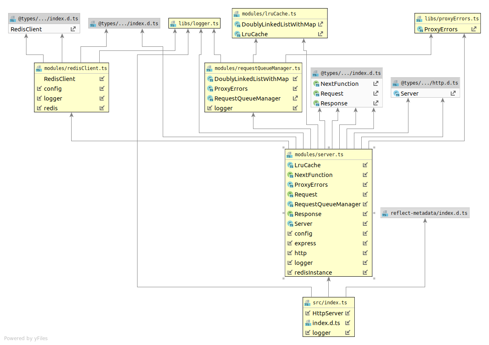

# Node.js proxy for get values from redis

## Development guide
* Run `docker-compose -f docker-compose.dev.yml up -d` for local development. In this mode working directory will mount
into container. Don't forget about `yarn build` before `docker-compose -f docker-compose.dev.yml restart proxy`.
* Run `docker-compose -f docker-compose.dev.yml up -d` to run standalone environment. Usually, this is not required.
If you need to run tests just execute `make test` (don't forget stop development containers, if running).

## Tests
* Stop development containers (`docker-compose -f docker-compose.dev.yml down`) and execute `make test`
* `make fillRedis` - fill redis by values (`key_1`, `key_2`, etc.)
* `make getValuesFromApi key_1 key_2` - get values from redis via api

## Documentation
### High-level architecture overview

### Components architecture overview

### What the code does
* Listen port
* Process request like `/:key`
* Send reading task for queue
* If queue is full, return `503` error to client
* Queue Manager get tasks from the queue according to maximum parallel tasks parameter
* Also, Queue Manager use doubly linked list for queue
* In tasks, via Redis Client trying to get value from Cache
* If no data in cache (no data, ttl, removed according to lru rule)then get data from Redis and save to cache
* Return value to user or `404` if value was not found

### Algorithmic complexity of the cache operations
* We are using doubly linked list and hash map (object).`
* There is no list crawling operations
* Complexity of add element to list is a constant
* Complexity of remove element from list is a constant
* Complexity of accessing to object value is a constant  
So, algorithmic complexity of the cache operations is `O(1)`.

### Instructions for how to run the proxy and tests
For tests and common usage use `docker-compose up -d`, `docker-compose -f docker-compose.dev.yml up -d` only for development
* `make test` - run tests
* `make fillRedis` - run proxy in docker and fill redis by values (`key_1`, `key_2`, etc.)
* `make getValuesFromApi key_1 key_2` - run proxy in docker  get values from redis via api
* `make start` - start proxy on 3000 port (configure store in `.env` file)
* `make stop` - stop proxy

### How long you spent on each part of the project
* Architecture scheme `30m`
* Architecture implimentation `30m`
* HTTP web service `1h`
* Cache `1h30m`
* Parallel concurrent processing `1h30m`
* Tests `2h`
* Makefile, Readme, schemas `2h`

### Not implemented requirements
* Redis client protocol. It'n not implemented by time-related reasons. 
Due to the fact that Redis uses TCP, consistent hashing can not be implemented on nigix.
To do this, it will be necessary to add another service (on node.js, for instance) that will routing requests using consistent hashing.
